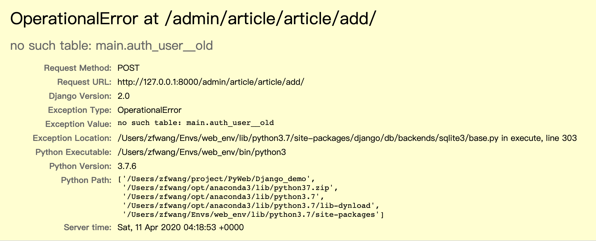

# Django 基本应用结构

## 1.Django APP

### 1.1 创建 APP

```shell
$ python3 manage.py startapp article
```

项目结构：

```
Django_demo
  ├── Django_demo
  │   ├── __init__.py
  │   ├── settings.py
  │   ├── urls.py
  │   ├── views.py
  │   └── wsgi.py
  ├── article
  │   ├── migrations
  │   │   └── __init__.py
  │   ├── __init__.py
  │   ├── admin.py
  │   ├── apps.py
  │   ├── models.py
  │   ├── tests.py
  │   └── views.py
  ├── db.sqlite3
  └── manage.py
```

### 1.2 创建 APP 模型

编辑 `./Django_demo/article/models.py`：

```python
from django.db import models

# Create your models here.
class Article(models.Model):
    title = models.CharField(max_length = 30) # 标题
    content = models.TextField()                   # 内容
```

### 1.3 同步数据库

1.注册 APP

编辑 `Django_demo/Django_demo/setting.py`

```python
INSTALLED_APPS = [
    'django.contrib.admin',
    'django.contrib.auth',
    'django.contrib.contenttypes',
    'django.contrib.sessions',
    'django.contrib.messages',
    'django.contrib.staticfiles',
    'article',
]
```

2.数据库迁移：

```shell
$ python3 manage.py makemigrations
```

```shell
$ python3 manage.py migrate
```

项目结构：

```
Django_demo
  ├── Django_demo
  │   ├── __init__.py
  │   ├── settings.py
  │   ├── urls.py
  │   ├── views.py
  │   └── wsgi.py
  ├── article
  │   ├── __init__.py
  │   ├── admin.py
  │   ├── apps.py
  │   ├── migrations
  │   │   ├── 0001_initial.py # 数据库迁移文件，说明数据库如何生成的逻辑
  │   │   ├── __init__.py
  │   ├── models.py
  │   ├── tests.py
  │   └── views.py
  ├── db.sqlite3
  └── manage.py
```

### 1.4 APP 配置

启动服务：

```shell
$ python3 manage.py runserver
```

进入 admin 页面

```
http://localhost:8000/admin/
```

使 APP 在后台页面显示

编辑 `.Django_deom/article/admin.py`：

```python
from django.contrib import admin
from .models import Article

# Register your models here.
admin.site.register(Article)
```

增加 Article:

* title
* content

修改页面语言：

```python
# LANGUAGE_CODE = 'en-us'
LANGUAGE_CODE = 'zh-Han'
```

## 2.报错及修复

1. 报错信息



2.解决方法

第一步：更新 Django 到 `2.1.5` 版本

```shell
pip3 install Django==2.1.5
```

第二步：重新进行数据库迁移

```shell
python3 manage.py migrate
```

第三步：重新迁移 APP

```shell
python3 mange.py makemigrations article
python3 manage.py migrate article
```

