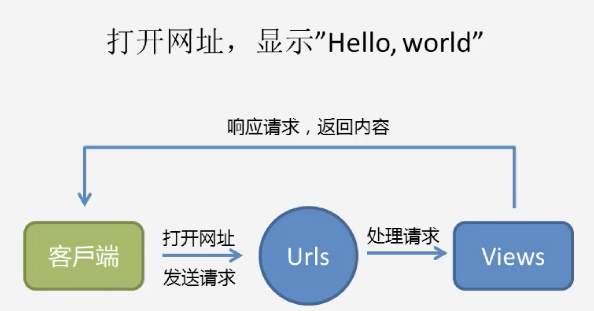

# Django 的入门仪式

## 1.创建 Django 项目

```shell
$ django-admin startproject <project_name>
```

## 2.Django 项目基本结构

```
Django_demo
  ├── Django_demo     -----> Python package
  │   ├── __init__.py -----> Python package script
  │   ├── settings.py -----> 全局设置文件
  │   ├── urls.py     -----> 全局路由控制
  │   └── wsgi.py     -----> 服务器使用 wsgi 部署的文件
  └── manage.py       -----> Django 项目管理
```

## 3.响应请求



### 3.1 编辑 `urls.py`

```python
from django.contrib import admin
from django.urls import path, re_path
from . import views

urlpatterns = [
    path('admin/', admin.site.urls), # 后台管理
    path("", views.index),
    # re_path("^$", views.index),
]
```

### 3.2 创建并编辑 `views.py`

```python
from django.http import HttpResponse

def index(request):
    return HttpResponse("Hello, world.")
```

## 4.启动本地 Django 服务

### 4.1 登录页面、输出 `Hello, world.`

```shell
cd Django_deom
$ python3 manage.py runserver
```

### 4.2 管理员权限登录网站：

```shell
$ python3 manage.py help

# 初始化后台服务器
$ python3 manage.py migrate

# 创建超级管理员
$ python3 manage.py createsuperuser
$ wangzf
$ tinker123456

# 重新启动 Django 服务
$ python3 manage.py runserve
```

项目结构：

```
Django_demo
  ├── Django_demo
  │   ├── __init__.py
  │   ├── settings.py
  │   ├── urls.py
  │   ├── views.py
  │   └── wsgi.py
  ├── db.sqlite3
  └── manage.py
```